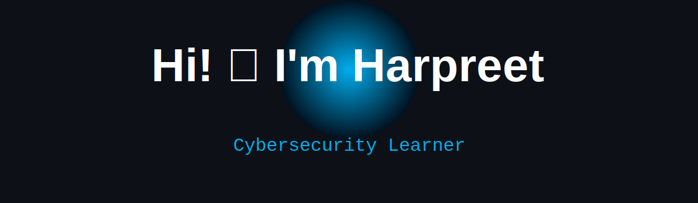

<!-- <h1 align="center">Hi 👋 I'm Harpreet</h1>

<p align="center">

</p>

---

## 👨‍💻 About Me

- 🎓 Computer Science student from India
- 🔐 Exploring Cybersecurity
- 🌱 Learning Java, Networking & Linux
- 💻 Interested in SOC Analyst roles
- 🤝 Open to collaboration

---

## 🛠 Tech Stack

<p align="center">

</p> -->


<!--
<div align="center">



<br><br>-->

<p align="center">

</p>


<br>


</div>

---

# 🕶️ WHOAMI

```bash
┌──(harpreet㉿cybersec)-[~]
└─$ whoami

Name        : Harpreet Singh
Location    : India
Role        : Cybersecurity Learner
Focus       : Linux | Networking | SOC
Languages   : Java, Python, C
Goal        : Security Analyst
Status      : Always Learning
```

---

# 🚨 Security Operations Center Dashboard

```yaml
Threat Level        : LOW

Cybersecurity       : ███████░░░ 70%
Linux               : ████████░░ 80%
Networking          : ███████░░░ 70%
Java                : ████████░░ 85%
Python              : ██████░░░░ 60%
React               : █████░░░░░ 50%

Current Objective:
→ Become a SOC Analyst
→ Master Networking
→ Build Security Projects

System Status:
🟢 ACTIVE
```

---

# 🎯 Current Mission

- 🔐 Learning Cybersecurity Fundamentals
- 🌐 Mastering Computer Networks
- 🐧 Linux Administration
- 🛡️ Security Monitoring & SOC Concepts
- ☁️ Exploring Cloud Security
- 💻 Building Real-World Security Projects

---

# ⚡ Cyber Arsenal

<div align="center">


</div>

---

# 🔥 Featured Projects

### 🛡 Smart Classroom Cognitive Comfort Index System
- ESP32 + IoT Sensors
- Real-Time Dashboard
- PostgreSQL + Node.js + React

### ❤️ VitalCare
- AI-Powered Health Diagnostic Assistant
- Symptom Analysis & Wellness Tracking

### 🌧 Smart Rainwater Conservation System
- IoT Monitoring & Water Analytics

---

# 🌐 Connect With Me

<div align="center">

<a href="https://linkedin.com/in/YOUR_LINKEDIN">

</a>

<a href="https://github.com/cyberharpreet">

</a>

</div>

---

# 🛡️ Cybersecurity Philosophy

> Security is not a product, but a process.

> The quieter you become, the more you are able to hear.

---

<div align="center">

### ⚡ Building • Learning • Securing ⚡


</div>


</div>
